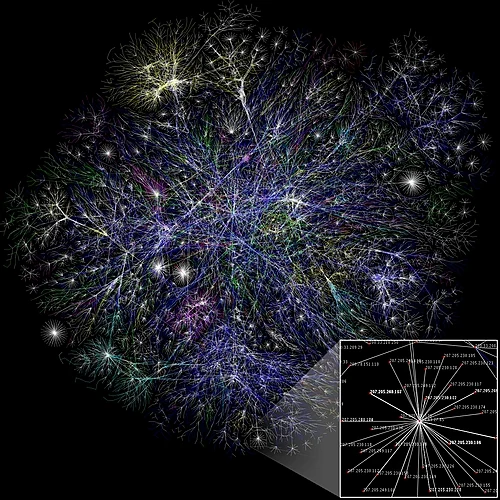
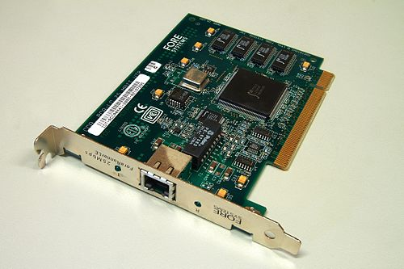

# Computer Networking

<!-- markdownlint-disable MD033 -->

    

<!-- markdownlint-enable MD033 -->

It contains

- **Why** (motivation)
- **How** (real-world application)
- **What** (internal mechanisms),
- **Where** (use cases)
- **How-to** (optimization and design).

---

## (Read this first)

| Term | Explains|
|---|---|
|OSI |“what should happen”|
|TCP/IP |shows “what actually happens.”|
|TCP|reliable and ordered (3‑way handshake, ACKs, retransmissions).|
|UDP|fast and connectionless.|
|IP|routes between networks|
|MAC|delivers on the local link.|

- Wireshark: your microscope. Use filters to see each layer’s behavior.

---

## Study roadmap (how to use these notes)

1) Skim and Why to ground motivation.
2) Learn layers top-down: Application → Transport → Internet → Link/Physical.
3) Run the Wireshark labs as you read each section.
4) Keep the Ports and Devices cheat sheets open while practicing.
5) Finish with Quick Review and Self-check questions.

---

## Quick TOC

- Why Study Computer Networks?
- Practical Learning with Wireshark
- The OSI Model (Open Systems Interconnect)
- The Seven Layers of the OSI Model
- OSI Model vs TCP/IP Model
- Data Encapsulation and Decapsulation
- Key Network Devices and Their Layers
- Well-known ports cheat sheet
- Glossary
- Quick Review
- Self-check Questions

---

## Why Study Computer Networks?

Understanding computer networks is paramount in our digitized world, as they form the backbone of modern communication.

- **Daily Ubiquity**: We constantly interact with networks when browsing the internet, sending emails, making video calls (`WhatsApp`, `Skype`), or logging into remote systems.
- **Essential for Engineers**:
  - **CS/IT Engineers**: Build core applications like web browsers (`Chrome`), email clients (`Outlook`), and real-time communication systems.
  - **Big Data Engineers**: Rely on networks to interconnect systems and facilitate massive data transfers.
  - **Network Engineers**: Directly construct and maintain the physical and computational infrastructure for data transfer.
- **Demystifying Common Terms**: This knowledge clarifies the true meaning and function of terms like **MAC address**, **IP address**, **router**, **Wi-Fi**, **DNS**, **HTTP**, and **HTTPS**.
- **Deep Functional Understanding**: You will learn the internal workings of web browsers, calling systems, and other network-enabled software.

---

## Well-known ports cheat sheet

Common ports to memorize for protocol identification and filtering.

- 20/21: FTP (data/control)
- 22: SSH
- 23: Telnet
- 25: SMTP
- 53: DNS (UDP/TCP)
- 67/68: DHCP (server/client)
- 80: HTTP
- 110: POP3
- 143: IMAP
- 161/162: SNMP
- 389: LDAP
- 443: HTTPS (TLS)
- 3389: RDP

    

Tip: In Wireshark, try filters like `tcp.port == 443` or `udp.port == 53`.

---

## The OSI Model (Open Systems Interconnect)

The OSI model is a foundational, 7-layer **conceptual framework** designed to standardize network communication and ensure interoperability between diverse systems (e.g., Mac, Windows, IoT devices).

- **Host**: Any device participating in a network (e.g., smartphone, laptop, server).
- **Server**: A specialized host that "serves" data to other hosts (clients).
- **Protocols**: Agreed-upon sets of rules governing how data is formatted, transmitted, and interpreted, much like grammar in human language.

### Analogy: The Philosopher-Translator-Secretary Architecture

This analogy perfectly illustrates the concept of a layered system.

> **Goal**: A philosopher in one location wants to send the message "I like rabbits" to another philosopher in a different location.
>
> 1. **Philosopher (Layer 3)**: Originates the message in their native language (e.g., English).
> 2. **Translator (Layer 2)**: Translates the message into a common intermediate language (e.g., Dutch).
> 3. **Secretary (Layer 1)**: Takes the Dutch message and transmits its binary representation using a physical medium (e.g., a fax machine).
>
> The process is reversed at the receiving end, with each layer logically communicating with its **peer layer** (e.g., translator-to-translator) while passing data to adjacent layers in its own system.

### Addresses in Computer Networks

- **IP Address (Logical Address)**: A software-based address assigned to a device, like a home address. It can change depending on the network.
- **MAC Address (Physical Address)**: A unique, permanent hardware identifier burned into a device's Network Interface Card (NIC), like a serial number.

---

## The Seven Layers of the OSI Model

### Layer 7: Application Layer

- **Function**: Provides network services directly to end-user applications. This is the layer we interact with.
- **Analogy**: The Philosopher who creates and understands the final message.
- **Key Protocols**:
  - `HTTP` & `HTTPS`: For web browsing.
  - `FTP`: For file transfers.
  - `SMTP` & `POP`: For sending and receiving emails.
  - `DNS`: To translate domain names into IP addresses.
  - `Telnet` & `RDP`: For remote login and desktop access.
- **Note**: A browser like Chrome is an *application*, not the layer itself. The layer defines the protocols the application uses.

### Layer 6: Presentation Layer

- **Function**: Responsible for data translation, compression, and encryption/decryption. It ensures data is in a usable format for the application.
- **Analogy**: The Translator who converts the message into a common language.
- **Key Tasks**:
  - **Translation**: Converts data between different formats (e.g., ASCII to binary).
  - **Compression**: Reduces data size for faster transmission (e.g., for video/audio).
  - **Encryption/Decryption**: Secures data using protocols like `SSL/TLS` for `HTTPS`.

### Layer 5: Session Layer

- **Function**: Establishes, manages, and terminates communication sessions between applications.
- **Key Tasks**:
  - **Authentication**: Verifying user identity (e.g., login with username/password).
  - **Authorization**: Determining permissions for authenticated users.
  - **Session Management**: Maintaining a connection (e.g., keeping a user logged in).
  - **Note**: In modern systems, the Application, Presentation, and Session layers are often handled cohesively by the application software (e.g., a web browser).

### Layer 4: Transport Layer

- **Function**: Provides end-to-end communication, ensuring reliable and efficient data transfer between applications on different hosts.
- **Unit of Data**: **Segment** (for TCP) or **Datagram** (for UDP).
- **Key Protocols**:
  - **TCP (Transmission Control Protocol)**:
    - **Reliable & Connection-Oriented**: Establishes a connection (via a **three-way handshake**) and guarantees data delivery in order using acknowledgments (ACKs) and retransmissions.
    - **Use Cases**: Web browsing (`HTTP`), email (`SMTP`), file transfer (`FTP`), where data integrity is critical.
  - **UDP (User Datagram Protocol)**:
    - **Unreliable & Connectionless**: Sends data without establishing a connection. It's fast but doesn't guarantee delivery or order.
    - **Use Cases**: Video/audio streaming (`Skype`), online gaming, `DNS`, where speed is more important than perfect data integrity.
- **Key Tasks**:
  - **Segmentation & Reassembly**: Breaks large data into smaller segments and reassembles them at the destination.
  - **Port Addressing**: Uses port numbers (e.g., Port 80 for HTTP) to direct data to the correct application on a host.
  - **Flow & Error Control**: Manages transmission speed and uses **checksums** to detect data corruption.

> Quick review
>
> - TCP is reliable and ordered; UDP is fast and connectionless.
> - Wireshark: look for TCP SYN/SYN‑ACK/ACK and seq/ack numbers; UDP has no handshake.

### Layer 3: Network Layer

- **Function**: Responsible for logical addressing, path determination, and routing of data packets across different networks.
- **Unit of Data**: **Packet**.
- **Key Protocol**: **IP (Internet Protocol)**, including `IPv4` and `IPv6`.
- **Key Tasks**:
  - **Logical Addressing**: Assigns and manages unique **IP addresses**.
  - **Routing**: Forwards packets between networks using **routers**.
  - **Path Determination**: Finds the best path for data to travel across the internet, often using algorithms like shortest path.
  - **DNS Interaction**: While DNS is an application layer protocol, the IP address it provides is used by this layer to create packets.

### Layer 2: Data Link Layer

- **Function**: Manages data transfer across a direct physical link between two connected devices (node-to-node).
- **Unit of Data**: **Frame**.
- **Key Address**: **MAC Address (Physical Address)**.
- **Key Tasks**:
  - **Framing**: Encapsulates network layer packets into frames, adding a header (with source/destination MAC addresses) and a trailer (for error detection).
  - **Media Access Control (MAC)**: Manages access to a shared physical medium to avoid collisions, ensuring only one device transmits at a time (e.g., using `CSMA/CD` for Ethernet).
  - **Error Detection**: Uses codes like **Cyclic Redundancy Check (CRC)** to detect if a frame was corrupted during transmission and discards it if necessary.

### Layer 1: Physical Layer

- **Function**: Responsible for the transmission and reception of raw bit streams (0s and 1s) over a physical medium.
- **Unit of Data**: **Bits**.
- **Key Task**: **Bit-to-Signal Translation**. It converts digital bits into signals suitable for the medium:
  - **Copper Wire (Ethernet)**: Electrical signals (e.g., +5V for a '1', 0V for a '0').
  - **Fiber Optic Cable**: Light signals (e.g., laser on/off).
  - **Wireless (Wi-Fi, 4G/5G)**: Radio signals (radio waves).

    

---

## OSI Model vs TCP/IP Model

While the OSI model is a theoretical guide, the TCP/IP model is the **practical model** used for the internet today.

| OSI Layer | TCP/IP Layer | Example Protocols |
| --- | --- | --- |
| Application (L7) | Application | HTTP, SMTP, DNS, FTP |
| Presentation (L6) | Application | TLS/SSL, codecs, formats |
| Session (L5) | Application | Sessions, auth, cookies |
| Transport (L4) | Transport | TCP, UDP |
| Network (L3) | Internet | IP, ICMP |
| Data Link (L2) | Network Access | Ethernet, Wi‑Fi, ARP |
| Physical (L1) | Network Access | Copper, Fiber, RF |

    

---

## Data Encapsulation and Decapsulation

This is the process of adding and removing control information as data moves through the layers.

### Sending Data (Encapsulation: Top-Down)

1. **Application**: Creates data (e.g., an HTTP request).
2. **Transport**: Encapsulates data into a **Segment** (adds TCP/UDP header with port numbers).
3. **Network**: Encapsulates the segment into a **Packet** (adds IP header with IP addresses).
4. **Data Link**: Encapsulates the packet into a **Frame** (adds header with MAC addresses and a trailer).
5. **Physical**: Transmits the frame as **bits** (signals) over the network medium.

### Receiving Data (Decapsulation: Bottom-Up)

The process is reversed. Each layer strips off its corresponding header, checks the information, and passes the remaining data up to the next layer until the original application data reaches the destination application.

---

## Key Network Devices and Their Layers

### Hub (Layer 1 - Physical)

- **Functionality**: A "dumb" repeater. It receives a signal and broadcasts it to all other connected ports.
- **Domains**: Creates one large **collision domain**, making it inefficient and obsolete.

### Switch (Layer 2 - Data Link)

- **Functionality**: An "intelligent" device that forwards frames only to the specific port of the destination device, using a **MAC address table**.
- **Domains**: Each port is its own **collision domain**, drastically reducing collisions. It operates in a single **broadcast domain**. The standard for modern LANs.

### Router (Layer 3 - Network)

- **Functionality**: A "post office" that connects different networks and forwards packets between them based on **IP addresses**.
- **Domains**: Each port is a separate **broadcast domain** *and* a separate **collision domain**. Essential for internet connectivity.

---

## Glossary

- Host: Any device on a network that sends/receives data.
- Server: A host that serves resources to clients.
- Protocol: A set of rules for how data is formatted and exchanged.
- IP address: Logical address used for routing between networks.
- MAC address: Physical link-layer address burned into the NIC.
- Segment/Datagram: Transport-layer unit (TCP/UDP).
- Packet: Network-layer unit (IP header + transport data).
- Frame: Link-layer unit (MAC header + packet + trailer/CRC).

---

## Quick Review

### OSI vs TCP/IP

- OSI has 7 layers; TCP/IP typically has 4.
- TCP/IP Application = OSI Application + Presentation + Session.
- TCP/IP Network Access = OSI Data Link + Physical.

### TCP vs UDP

- TCP: connection-oriented, reliable, ordered; handshake and ACKs.
- UDP: connectionless, best-effort, low-latency; no handshake.

### Devices

- Hub: repeats at L1; single collision domain; obsolete.
- Switch: forwards by MAC at L2; per-port collision domains; one broadcast domain (per VLAN).
- Router: routes by IP at L3; splits broadcast domains; per-interface collision domain.

---

## Self-check Questions

1) What differences between IP and MAC addresses determine where they’re used in delivery vs routing?
2) How does a TCP 3‑way handshake establish reliability, and what will Wireshark show you for it?
3) When would you choose UDP over TCP, and why?
4) Walk through encapsulation for an HTTPS request (include DNS resolution, ports involved, and TLS).
5) How do switches and routers change collision and broadcast domains along a path?

Use Wireshark to validate each answer with a short capture.

---

## Practical Learning with Wireshark

To bridge the gap between theory and practice, this guide emphasizes the use of **Wireshark**.

- **Tool**: Wireshark is a powerful network protocol analyzer (or "sniffer") that lets you see what’s happening on your network at a microscopic level.
- **Purpose**: It allows you to observe actual network traffic, byte by byte, reinforcing theoretical concepts with a tangible, "under-the-hood" view.
- **Recommendation**: Install Wireshark (available for Mac, Linux, Windows) to follow along, perform personal analysis, and gain a real-world understanding of network protocols.

---
